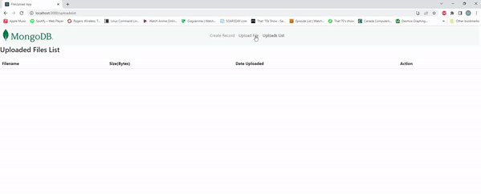

# FileUpload
A MERN stack application that allows users to upload images to the database.
This web app uses a MEARN app template available at [Mongo DB](https://www.mongodb.com/languages/mern-stack-tutorial).

